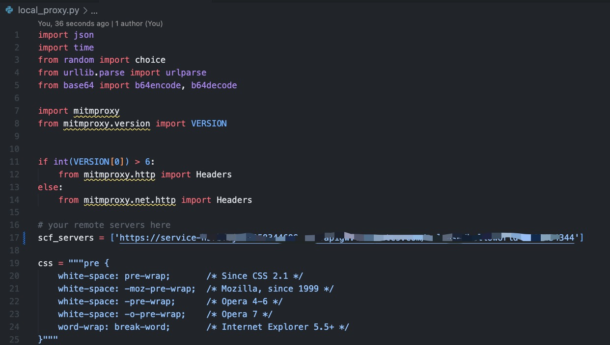

# middleman
middle man, a proxy use cloud functions as an traffic proxy, cuz some cloud functions are running in foreign regions which don't have network limitations like China mainland.

here is the traffic flow:

browser(url: google.com) -> local-proxy(mitmproxy) -> remote-proxy(cloud functions in foreign regions) -> google.com -> remote-proxy(cloud functions) -> local-proxy(mitmproxy) -> browser

## Quick Start
### 1st, create an cloud function in Tencent Cloud and deploy it. (set `SCF_TOKEN` same as 2nd step in code `remote_proxy.py`)


### 2nd, start local proxy (set `SCF_TOKEN` and `SCF_SERVERS` as following in `local_proxy.py`)

```bash
mitmdump -s local_proxy.py -p 8081 --no-http2 --ssl-insecure 
```

### 3rd, now point your brower to this local proxy and surf the internet!!!
```bash
local proxy address: localhost:8081
```
